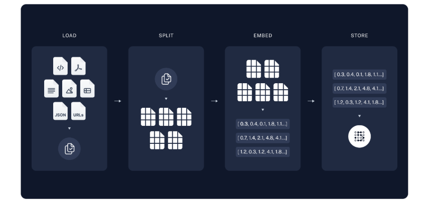
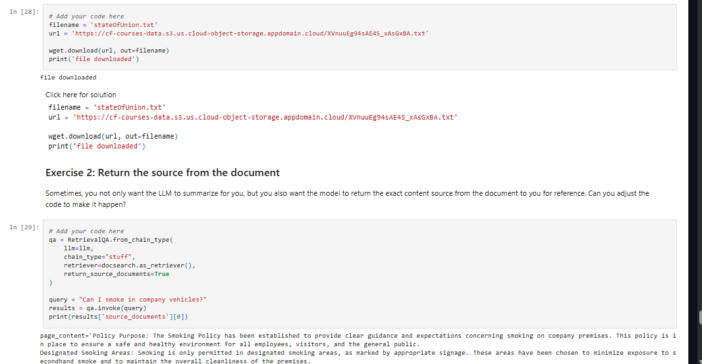

# 📚 Summarize Private Documents Using RAG, LangChain, and LLMs

[](https://www.python.org/)
[](https://www.langchain.com/)
[](https://www.ibm.com/watsonx)
[](LICENSE)

---

## 📌 Contexte du projet

Ce projet permet de résumer des documents privés en utilisant la technique **RAG (Retrieval-Augmented Generation)** avec **LangChain** et les **LLMs d'IBM watsonx.ai**.

**Objectif** : Créer un assistant capable de lire et résumer des documents confidentiels sans les exposer à des modèles publics.

---

## 🧠 Architecture RAG



| **Composant** | **Description** |
|---------------|-----------------|
| **Indexing** | Chargement, split en chunks, embedding et stockage vectoriel |
| **Retrieval & Generation** | Récupération des chunks pertinents et génération de réponses |

---

## 📊 Exemple d'utilisation

### Interface du chatbot


### Question : What is the smoking policy?


### Document source


---

## 🛠️ Stack technique

- **LangChain** : Gestion des chaînes de traitement
- **HuggingFace Embeddings** : Génération des embeddings
- **Chroma DB** : Stockage vectoriel
- **IBM watsonx.ai** : LLM (Llama, Mistral)
- **Python** : Langage principal

---

## 🔧 Installation

```bash
# Cloner le dépôt
git clone https://github.com/kabangesylvain-ui/rag-langchain-llm-summarizer.git
cd rag-langchain-llm-summarizer

# Installer les dépendances

# Lancer l'agent interactif
qa()
pip install -r requirements.txt
